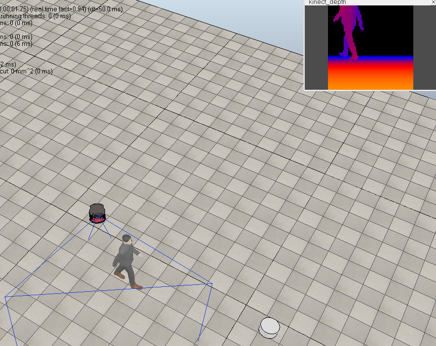

## Introduction
    This package uses Deep Reinforcement Learning(DQN) to train a differential drive robot with a kinect 
    to follow a worker.
      

`config.py:` configuration file 
`DQN.py:` the main file 
`vrepInterface.py:` interface file between python code with V-REP 
`env.py:` environment file 
`robot_DQN.ttt:` the scene to de loaded in V-REP 
`vrep.py, vrepConst.py, remoteApi.so:` the remote API bridge offered by V-REP

## Reinforcement Learning
* [x] [DQN](./DQN.py)
* [x] [Imitation Learning](./imitationLearning.py)
* [ ] Continous Space

`Environment：` V-REP 
`State：` the depth image from kinect  
`Action：` five valid actions(can be changed in config.py) 
`Reward:` get_reward function (env.py)
 
## Run the demo by yourself
Tested on Ubuntu 16.04 (64 bits) and V-REP PRO EDU 3.4.0. 
1> Open V-REP 
~~~
# in your V-REP installation folder
./vrep.sh
~~~
load the scene: `File -> Open Scene -> robot_DQN.ttt` 

Recommended simulation settings for V-REP scenes:
* Simulation step time: 50 ms  (default) 
* Real-Time Simulation: Enabled

2> Execute the learning algorithm
~~~
python DQN.py
~~~
## Reference
[Double-Dueling-DQN](https://github.com/awjuliani/DeepRL-Agents/blob/master/Double-Dueling-DQN.ipynb) 
[DeepLearningFlappyBird](https://github.com/yenchenlin/DeepLearningFlappyBird)
