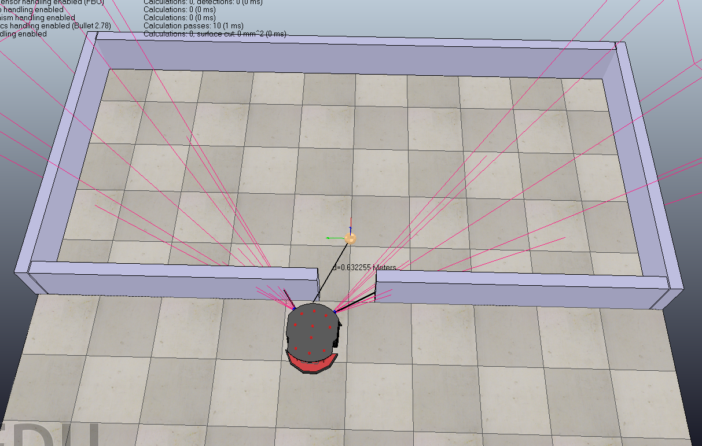

## Introduction
    This package uses Reinforcement Learning to train a differental drive robot with only two ultrasonic 
    sensors to go through a narrow door which is just a little wider than the robot.
    

`config.py:` configuration file 
`robot.py:` the main file 
`vrepInterface.py:` interface file between python code and V-REP 
`sarsa.py:` SARSA algorithm 
`qlearning.py:` Q-learning algorithm 
`robot.ttt:` the scene to de loaded in V-REP 
`vrep.py, vrepConst.py, remoteApi.so:` the remote API bridge offered by V-REP

## Reinforcement Learning
* [x] [SARSA](./sarsa.py)
* [x] [Q-learning](./qlearning.py)
* [ ] Policy Gradient Methods
* [ ] Deep Q-learning 

`Environment：` V-REP 
`State：` the data from two ultrasonic sensors 
`Action：` eight valid actions(can be changed in config.py) 
`Reward:` get_reward function of class LearningAgent(robot.py)

## Run the demo by yourself
Tested on Ubuntu 16.04 (64 bits).

open V-REP  
~~~
# in your V-REP installation folder
./vrep.sh
~~~
load the scene: `File -> Open Scene -> robot.ttt` 

Recommended simulation settings for V-REP scenes:
* Simulation step time: 50 ms  (default) 
* Real-Time Simulation: Enabled 

excute the learning algorithm
~~~
python robot.py
~~~
## Reference
[RL-ROBOT](https://github.com/angelmtenor/RL-ROBOT) 
[basic_reinforcement_learning](https://github.com/vmayoral/basic_reinforcement_learning) 
[Automatic-Parking](https://github.com/taochenshh/Automatic-Parking) 

